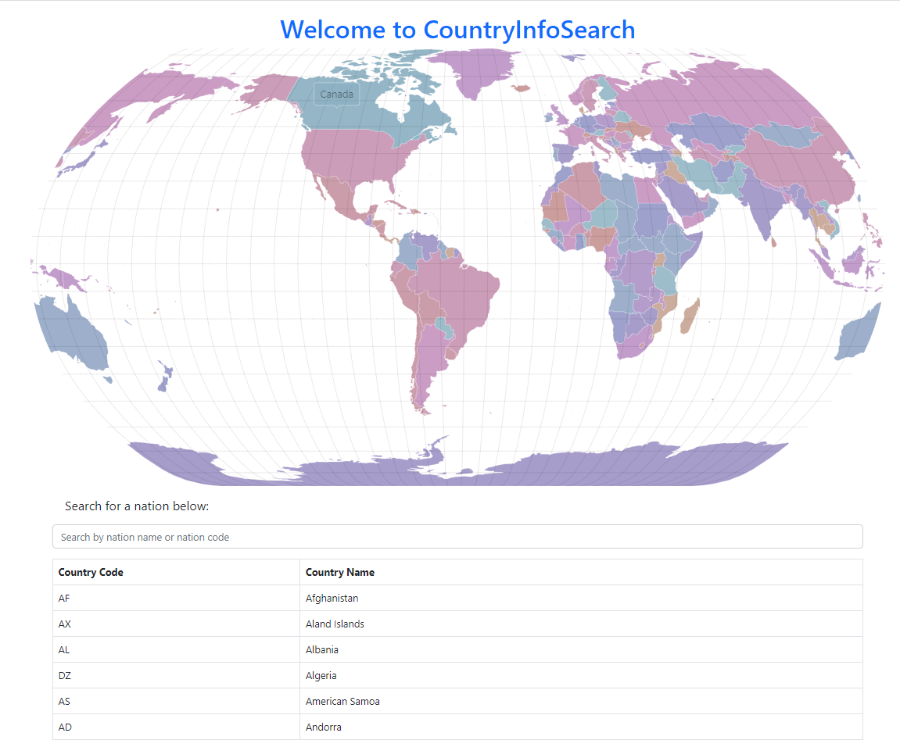

## Features
Search for a country by name or country code.
View detailed information about a selected country, including GDP, population density, employment data, and more.
Responsive design to ensure optimal user experience on various devices.

## Technologies Used
React
React Router
Bootstrap
Fetch API for making API requests

## Dependencies

This app uses the following libraries and packages:

- [React](https://reactjs.org/)
- [React Router](https://reactrouter.com/)
- [Bootstrap](https://getbootstrap.com/)
- [@amcharts/amcharts5](https://www.amcharts.com/)

## API Information
This app uses external APIs to retrieve country data. You need to sign up for the required APIs and obtain API keys.

Country Detail API: This API provides detailed information about countries.
License
This project is licensed under the MIT License - see the LICENSE file for details.

